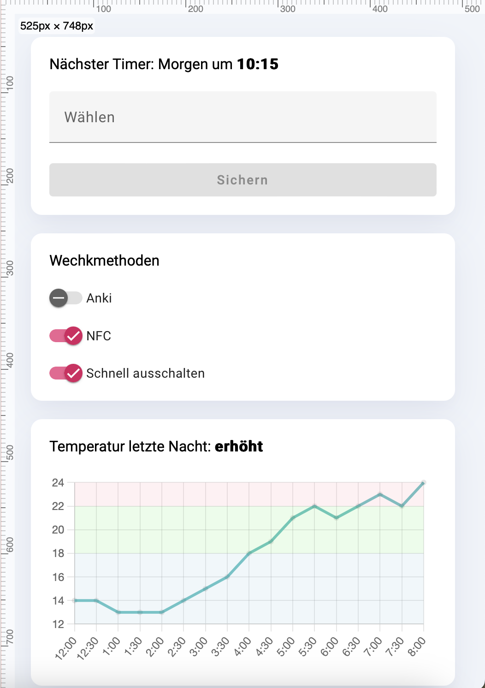
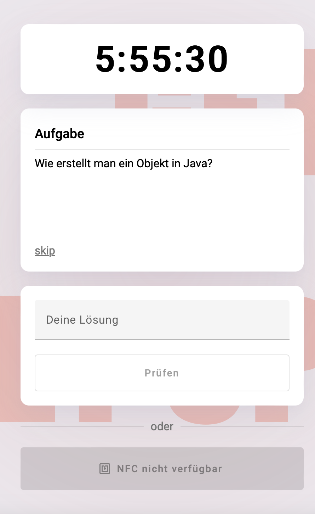

# CleverClock

[](logo.png)

## Overview
This project is a smart alarm clock that makes you scan an NFC tag or integrates with Anki to ensure you wake up by answering a series of questions. The project uses Angular for the frontend, Firebase for storage, and an Arduino for the hardware interface. The questions are evaluated using Google's Vertex AI.

## Table of Contents
1. [Features](#features)
2. [Installation](#installation)
3. [Usage](#usage)
4. [Configuration](#configuration)
5. [Authors](#authors)
6. [Screenshots](#screenshots)
7. [Demo](#demo)

## Features
- Set alarms with a customizable schedule.
- Integrate Anki questions to create quizzes that must be answered to turn off the alarm.
- Use Google's Vertex AI to evaluate the answers.
- Use alternative methods to get you out of bed, such as having to scan an NFC tag located elsewhere in your room/building.
- Frontend built with Angular.
- Firebase for data storage and serverless infrastructure.
- Arduino integration for hardware control.

## Installation
### Prerequisites
- Node.js and npm
- Angular CLI
- Firebase CLI
- Firebase account and project
- A billing account (it should remain free if you don't overuse the app).
- Have the Vertex AI API enabled.
- Arduino IDE and required libraries.

### Frontend Setup
1. Clone the repository:
    ```bash
    git clone https://github.com/lui-ah/cleverclock.git
    cd cleverclock/angular-app
    ```

2. Install dependencies:
    ```bash
    npm install
    ```

3. Set up Firebase:
    - Create a Firebase project at [Firebase Console](https://console.firebase.google.com/).
    - Add your app to the Firebase project.
    - Obtain your Firebase configuration and insert it into `src/environments/environment.prod.ts`:
      ```typescript
      export const environment = {
        production: false,
        firebaseConfig: {
          apiKey: "YOUR_API_KEY",
          authDomain: "YOUR_AUTH_DOMAIN",
          projectId: "YOUR_PROJECT_ID",
          storageBucket: "YOUR_STORAGE_BUCKET",
          messagingSenderId: "YOUR_MESSAGING_SENDER_ID",
          appId: "YOUR_APP_ID"
        }
      };
      ```

4. Deploy your functions. Inside the `functions` directory, run:
    ```bash
    npm run deploy
    ```

5. Run the development server:
    ```bash
    ng serve
    ```

6. Deploy the app to install it on your device after logging into your Firebase account:
    ```bash
    firebase login
    ng deploy
    ```

### Arduino Setup
1. Follow the hardware guide `arduino/README.md`.
2. Connect your Arduino to your computer.
3. Open the Arduino IDE and load the project files from `arduino/`.
4. Install any required libraries listed in the `arduino/README.md`.
5. Upload the sketch to your Arduino board.

## Usage
1. Set an alarm and import Anki questions for the quiz.
2. Enable all desired wake options.
3. When the alarm goes off, answer the questions correctly to disable the alarm.

## Configuration
- Ensure you have set up Firebase with the correct configuration.
- Customize the Arduino sketch as needed for your specific hardware setup.

## Screenshots

[](settings.png)
[](ringing.png)

## Demo

[](ringing.gif)
[](settings.gif)
